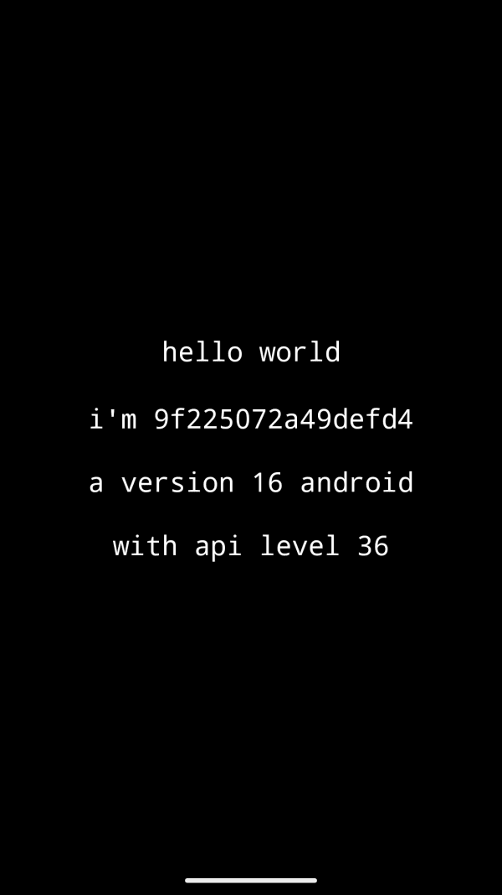

# Hello World Self-Aware

This is a small 121 KB Hello World app that lets the Android device introduce itself by "name" (serial number), Android version and API Level.
 
[Hello World apps](https://en.wikipedia.org/wiki/%22Hello,_World!%22_program) are usually not supposed to be useful. However, you may use this tiny app to quickly find out the Android version and API Level of the device. Because it's so tiny, doesn't have ads, and doesn't need any permissions, it's very easy to install even on older and less powerful hardware.

## Screenshot

## Download

## Building

To build and run the app, clone this project, open it as an existing project in Android Studio, and click Run.

## Contributing

Thank you for contributing! Hello World Self-Aware is designed to be as simple as possible, but you can still help with:

* testing and reporting bugs
* creating a nice Android app icon to replace the [current one](https://github.com/Appliberated/HelloWorldSelfAware/blob/main/app/src/main/res/mipmap-xxxhdpi/ic_launcher.png)

## License

Hello World Self-Aware is released under the [MIT License](https://github.com/Appliberated/HelloWorldSelfAware/blob/main/LICENSE).
